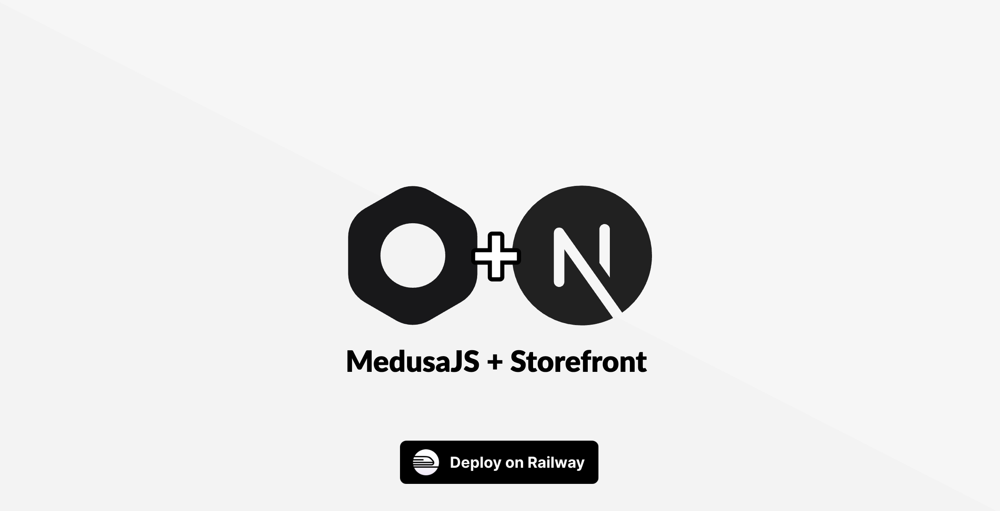

[](https://railway.com/deploy/PHj_sS?referralCode=karapi&utm_medium=integration&utm_source=template&utm_campaign=generic)

# MedusaJS 2.0 + Storefront Monorepo

A pre-configured monorepo for deploying **Medusa 2.0** (Backend) and **Next.js
15** (Storefront) on Railway, based on the official MedusaJS + Next.js
templates, NO extra dependencies.

## 🚀 Features

- **Backend**: Medusa v2.0 (Framework, Admin, Dashboard).
- **Storefront**: Next.js 15 Starter kit template integrated with Medusa.
- **Monorepo**: Managed with `pnpm workspace` for efficient dependency
  management.
- **Railway Optimized**: optimized configuration files (`railway.json`) and
  scripts for seamless deployment.

## ☁️ Deployment on Railway

This repository is optimized for Railway. Template uses Railway's Bucket for
media upload, avoiding extra costs of an extra service. One-click deployment on
Railway:

[](https://railway.com/deploy/PHj_sS?referralCode=karapi&utm_medium=integration&utm_source=template&utm_campaign=generic)

## 🛠️ Local Development

### Prerequisites

- Node.js v20+
- pnpm v10+
- PostgreSQL (else uses SQLite)
- Redis (else uses in-memory)

### Installation

1. **Clone**

   ```bash
   git clone https://github.com/medusajs/medusa.git
   ```

2. **Install dependencies:**

   ```bash
   pnpm install
   ```

   ```bash
   pnpm install
   ```

3. **Environment Setup & Seed:**

   Run the setup script to copy environment files and seed the database:

   ```bash
   pnpm setup
   # Note: You may need to update .env files with your specific keys
   ```

### Development

Start the development servers for both backend and storefront from the root:

```bash
pnpm dev
```

Alternatively, you can run them individually:

**Backend:**

```bash
cd backend
pnpm dev
```

**Storefront:**

```bash
cd storefront
pnpm dev
```

## 📚 Resources

- [Medusa Documentation](https://docs.medusajs.com/)
- [Next.js Documentation](https://nextjs.org/docs)
- [Railway Documentation](https://docs.railway.app/)
